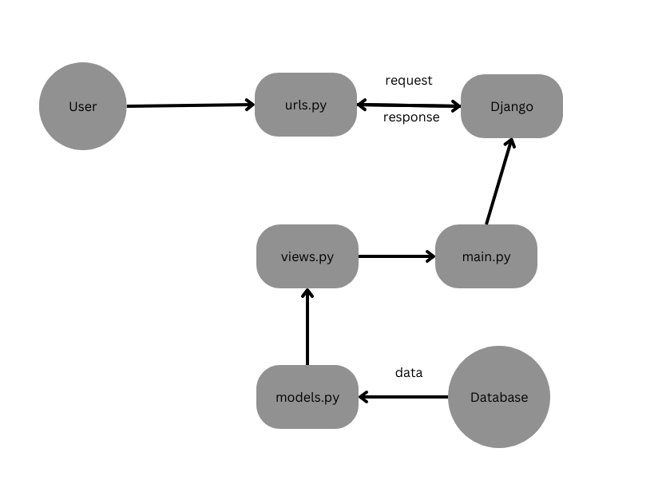

# rakhas-inventory
# Assignment 2
## Link
[Click here](https://rakhasinventory.adaptable.app/main/) to access app

## Steps
### Step 1. Create new Django project
1. Create virtual environtment in your new directory:
   ```
   python -m venv env
   ```
2. Activate VE:
   - Windows:
    ```
    env\Scripts\activate.bat
    ```
  - Mac:
    ```
    source env/bin/activate
    ```
3. Create 'requirements.txt' to install dependencies
   ```
    django
    gunicorn
    whitenoise
    psycopg2-binary
    requests
    urllib3
   ```
4. Run command :
   ```
     pip install -r requirements.txt
     django-admin startproject shopping_list .
   ```
### Step 2. Creating main application
1. create new application
   ```
     python manage.py startapp main
   ```
2. Register main application into the project.
   Open the settings.py in the project directory, add 'main' to INSTALLED_APPS
   ```
     INSTALLED_APPS = [
    ...,
    'main',
    ...
    ]
   ```
3. Create basic html file in new directory called templates inside the main application
   ```
   <h1>Rakha's Inventory Page</h1>

    <h5>Application Name:</h5>
    <p>{{ application_name }}</p>
    
    <h5>Name:</h5>
    <p>{{ name }}</p>
    
    <h5>Class:</h5>
    <p>{{ class }}</p>
   ```
4. Open models.py and change it to make new variable
   ```
    from django.db import models
    
    class Product(models.Model):
        name = models.CharField(max_length=255)
        category = models.CharField(max_length=255)
        amount = models.IntegerField()
        description = models.TextField()
   ```
5. Creating and applying model migrations
   ```
     python manage.py makemigrations
     python manage.py migrate
   ```
### Step 3. Connecting views to templates
1. Open views.py in the main application, add show_main function
   ```
      from django.shortcuts import render

        def show_main(request):
        	context = {
        		'application_name': "Rakha's Inventory",
        		'name': 'Rakha Fahim Shahab',
        		'class' : 'PBP KI'
        	}
	        return render(request, 'main.html', context)
   ```
### Step 4. URL routing
1. Create urls.py inside the main application directory
   add the following code :
   ```
     from django.urls import path
     from main.views import show_main
      
     app_name = 'main'
      
     urlpatterns = [
          path('', show_main, name='show_main'),
      ]
   ```
2. Edit the urls.py on the django project directory
   ```
     ...
     from django.urls import path, include
     ...
     urlpatterns = [
        ...
        path('main/', include('main.urls')),
        ...
      ]
   ```
## Flow Chart


# Assignment 3
## Questions
### 1.  What is the difference between POST form and GET form in Django?
The primary variance between POST and GET methods in Django lies in their data transmission mechanisms. POST conveys data within the body of the request, providing enhanced security and being apt for operations that modify data. Conversely, GET relays data by appending it to the URL, which, while less secure, is optimal for data retrieval functions. The selection between these methods should be predicated on the data's characteristics and the intended server operation.
### 2.  What are the main differences between XML, JSON, and HTML in the context of data delivery?
From a data delivery perspective, XML is tailored for intricate, hierarchical data constructs and boasts self-descriptive attributes. JSON, being succinct and easily comprehensible, is the prevalent choice for web application data interchange. HTML, however, primarily serves to delineate the architecture and content of web documents. Your selection between these formats should be driven by your unique data presentation and transmission requisites.
### 3. Why is JSON often used in data exchange between modern web applications?
JSON has risen to prominence in contemporary web application data interchange due to its straightforwardness, efficiency, and language-independent attributes. Furthermore, its widespread acceptance and alignment with the imperatives of swift, compatible, and user-friendly web development make it the favored choice.
## Steps
### Step 1. Configure routing from main/ to /
1. Activate VE:
   - Windows:
    ```
    env\Scripts\activate.bat
    ```
  - Mac:
    ```
    source env/bin/activate
    ```
2. open urls.py in rakhas_inventory. change main/ to ''
   ```
    urlpatterns = [
    path('', include('main.urls')),
    path('admin/', admin.site.urls),
   ]
   ```
### Step 2. Configure routing from main/ to /
1. Create templates folder inside root directory and create file named base.html. paste the following:
    ```
   
   <!DOCTYPE html>
   <html lang="en">
      <head>
         <meta charset="UTF-8" />
         <meta
               name="viewport"
               content="width=device-width, initial-scale=1.0"
         />
         
         
      </head>

      <body>
         
         
      </body>
   </html>
    ```
2. Adjust code in settings.py in rakhas_inventory folder
   ```
   ...
   TEMPLATES = [
      {
         'BACKEND': 'django.template.backends.django.DjangoTemplates',
         'DIRS': [BASE_DIR / 'templates'], # add this line
         'APP_DIRS': True,
         ...
      }
   ]
   ...
   ```

3. Change main.html inside templates in main folder
   ```
   
   
      <h1>Rakha's Inventory Page</h1>

      <h5>Application Name:</h5>
      <p>{{ application_name }}</p>

      <h5>Name:</h5>
      <p>{{ name }}</p>

      <h5>Class:</h5>
      <p>{{ class }}</p>
   
   ```
### Step 3. Creating data input form Showing product data in html
1. Create a new file inside main folder named forms.py. paste the following:
    ```
   from django.forms import ModelForm
   from main.models import Product

   class ProductForm(ModelForm):
      class Meta:
         model = Product
         fields = ["name","category", "amount", "description"]
         </head>

         <body>
            
            
         </body>
      </html>
    ```
2. Add imports to views.py in main folder and create new function called create product
   ```
   from django.http import HttpResponseRedirect
   from django.urls import reverse
   from main.forms import ProductForm
   from main.models import Product
   ```
   ```
   def create_product(request):
      form = ProductForm(request.POST or None)

      if form.is_valid() and request.method == "POST":
         form.save()
         return HttpResponseRedirect(reverse('main:show_main'))

      context = {'form': form}
      return render(request, "create_product.html", context)
   ```

3. Change show_main function
   ```
   def show_main(request):
      products = Product.objects.all()

      context = {
         'name': 'Rakha Fahim Shahab', # Your name
         'class': 'PBP KI', # Your PBP Class
         'products': products
      }

      return render(request, "main.html", context)
   ```

### Step 4. XML and JSON
1. Add the following functions in views.py
   ```
   def show_xml(request):
		data = Items.objects.all()
		return HttpResponse(serializers.serialize("xml", data), content_type="application/xml")


	def show_json(request):
		data = Items.objects.all()
		return HttpResponse(serializers.serialize("json", data), content_type="application/json")


	def show_xml_by_id(request, id):
		data = Items.objects.filter(pk=id)
		return HttpResponse(serializers.serialize("xml", data), content_type="application/xml")


	def show_json_by_id(request, id):
		data = Items.objects.filter(pk=id)
		return HttpResponse(serializers.serialize("json", data), content_type="application/json")

   ```
2. Also add the path in urls.py under urlpatterns = []
   ```
   ...
      path('xml/', show_xml, name='show_xml'),
		path('json/', show_json, name='show_json'),
		path('xml/<int:id>/', show_xml_by_id, name='show_xml_by_id'),
		path('json/<int:id>/', show_json_by_id, name='show_json_by_id'),
   ...

   ```
## Postman
### Screenshots
1. main


2. xml


3. json


4. xml1


5. json1


# Assignment 4
## Questions
### 1. What is UserCreationForm in Django?
UserCreationForm is a form provided by Django's built-in authentication framework. It's designed to simplify the creation of new user instances. Its advantages include rapid development due to pre-implemented fields and methods, built-in security measures for password handling, and automatic validation for fields like usernames. However, it has disadvantages such as limited default fields, potentially necessitating extensions for complex registration processes, and possible future challenges if migrating away from Django's built-in authentication.
### 2. What is the difference between authentication and authorization in Django application? Why are both important?
Authentication: This refers to the process of verifying the identity of a user. In a Django application, authentication checks whether a user is who they claim to be, typically through a username and password combination. Django's built-in django.contrib.auth system provides tools for user authentication.

Authorization: Once a user's identity is verified, authorization determines what that user is allowed to do. In Django, this means defining permissions that dictate what actions a user (or a group of users) can perform on specific objects or models. For example, a user might be authorized to view a post but not edit or delete it.

Importance:
Both are crucial for ensuring the security and proper functioning of a Django application. Authentication prevents unauthorized access by ensuring only registered and validated users can log in. Authorization, on the other hand, ensures that once logged in, users can only perform actions they're permitted to, protecting data and functionality from unintended access or modification.
### 3. What are cookies in website? How does Django use cookies to manage user session data?
In Django, cookies play a pivotal role in session management. By default, a cookie stores only a session ID, allowing the server to identify and maintain a user's session across requests by referencing the actual session data kept securely in the database. However, Django can also be configured to store the entire session data directly within the cookie, encrypting it for safety. While this direct storage can be more efficient in some cases, it comes with size constraints and potential security considerations. In essence, Django's use of cookies balances between efficiency and security in managing user sessions.
### 4. Are cookies secure to use? Is there potential risk to be aware of?
Cookies, integral to web technologies, present both utility and potential security vulnerabilities. When transmitted over unencrypted connections, they risk interception, especially if they contain sensitive data. Websites susceptible to Cross-site Scripting (XSS) can inadvertently expose cookies to theft. Reliance solely on cookies without additional safeguards can also open doors to Cross-site Request Forgery (CSRF) attacks. Session hijacking is another concern, where an attacker, after obtaining a user's session cookie, can achieve unauthorized account access.

There are also concerns about third-party cookies, often used by advertisers, which can track users across multiple sites, raising privacy issues. However, several mitigation strategies exist. Enforcing encrypted HTTPS connections, using the HttpOnly flag to prevent JavaScript access, setting the Secure flag to ensure cookies transmit only over HTTPS, and employing the SameSite attribute all enhance cookie security. Moreover, setting short expiration times and consistently sanitizing user inputs further bolster security. In essence, while cookies are invaluable, their careful management is paramount for maintaining both functionality and security.
## Steps
1. add login,logout and register function to views.py
   ```
   from django.shortcuts import render
   import datetime
   from django.http import HttpResponseRedirect
   from django.urls import reverse
   from main.forms import ProductForm
   from main.models import Product
   from django.http import HttpResponse
   from django.core import serializers
   from django.shortcuts import redirect
   from django.contrib.auth.forms import UserCreationForm
   from django.contrib import messages
   from django.contrib.auth import authenticate, login,logout
   from django.contrib.auth.decorators import login_required

   @login_required(login_url='/login')
   def show_main(request):
      products = Product.objects.filter(user=request.user)

      context = {
         'application_name': "Pirates Database",
         'name': request.user.username, # Your name
         'class': 'PBP KI', # Your PBP Class
         'products': products,
         'last_login': request.COOKIES['last_login'],
      }

      return render(request, "main.html", context)

   def create_product(request):
      form = ProductForm(request.POST or None)

      if form.is_valid() and request.method == "POST":
         product = form.save(commit=False)
         product.user = request.user
         product.save()
         return HttpResponseRedirect(reverse('main:show_main'))
      context = {'form': form}
      return render(request, "create_product.html", context)

   def show_xml(request):
      data = Product.objects.all()
      return HttpResponse(serializers.serialize("xml", data), content_type="application/xml")

   def show_json(request):
      data = Product.objects.all()
      return HttpResponse(serializers.serialize("json", data), content_type="application/json")

   def show_xml_by_id(request, id):
      data = Product.objects.filter(pk=id)
      return HttpResponse(serializers.serialize("xml", data), content_type="application/xml")

   def show_json_by_id(request, id):
      data = Product.objects.filter(pk=id)
      return HttpResponse(serializers.serialize("json", data), content_type="application/json")

   def register(request):
      form = UserCreationForm()

      if request.method == "POST":
         form = UserCreationForm(request.POST)
         if form.is_valid():
               form.save()
               messages.success(request, 'Your account has been successfully created!')
               return redirect('main:login')
      context = {'form':form}
      return render(request, 'register.html', context)

   def login_user(request):
      if request.method == 'POST':
         username = request.POST.get('username')
         password = request.POST.get('password')
         user = authenticate(request, username=username, password=password)
         if user is not None:
               login(request, user)
               response = HttpResponseRedirect(reverse("main:show_main")) 
               response.set_cookie('last_login', str(datetime.datetime.now()))
               return response
         else:
               messages.info(request, 'Sorry, incorrect username or password. Please try again.')
      context = {}
      return render(request, 'login.html', context)

   def logout_user(request):
      logout(request)
      response = HttpResponseRedirect(reverse('main:login'))
      response.delete_cookie('last_login')
      return response

   ```
2. create new html file for login page
   ```
   

   
      <title>Login</title>
   

   

   <div class = "login">

      <h1>Login</h1>

      <form method="POST" action="">
         
         <table>
               <tr>
                  <td>Username: </td>
                  <td><input type="text" name="username" placeholder="Username" class="form-control"></td>
               </tr>
                     
               <tr>
                  <td>Password: </td>
                  <td><input type="password" name="password" placeholder="Password" class="form-control"></td>
               </tr>

               <tr>
                  <td></td>
                  <td><input class="btn login_btn" type="submit" value="Login"></td>
               </tr>
         </table>
      </form>

      
         <ul>
               
                  <li>{{ message }}</li>
               
         </ul>
           
         
      Don't have an account yet? <a href="">Register Now</a>

   </div>

   

   ```
3. create new html file for register page
   ```
   

   
      <title>Register</title>
   

     

   <div class = "login">
      
      <h1>Register</h1>  

         <form method="POST" >  
                 
               <table>  
                  {{ form.as_table }}  
                  <tr>  
                     <td></td>
                     <td><input type="submit" name="submit" value="Daftar"/></td>  
                  </tr>  
               </table>  
         </form>

        
         <ul>   
                 
                  <li>{{ message }}</li>  
                    
         </ul>   
      

   </div>  

   

   ```
4. add logout button in main.html
   ```
   ...
   <br />

   <h5>Last login session: {{ last_login }}</h5>
   ...

   ```
5. add new url to login.html and register.html
   ```
   from django.urls import path
   from main.views import show_main, create_product, show_xml, show_json, show_xml_by_id, show_json_by_id,register,login_user,logout_user

   app_name = 'main'

   urlpatterns = [
      path('', show_main, name='show_main'),
      path('create-product', create_product, name='create_product'),
      path('xml/', show_xml, name='show_xml'),
      path('json/', show_json, name='show_json'),
      path('xml/<int:id>/', show_xml_by_id, name='show_xml_by_id'),
      path('json/<int:id>/', show_json_by_id, name='show_json_by_id'),
      path('register/', register, name='register'),
      path('login/', login_user, name='login'),
      path('logout/', logout_user, name='logout'),
   ]

   ```
6. change models.py to connect product to user
   ```
   from django.db import models
   from django.contrib.auth.models import User

   class Product(models.Model):
      user = models.ForeignKey(User, on_delete=models.CASCADE)
      name = models.CharField(max_length=255)
      category = models.CharField(max_length=255)
      amount = models.IntegerField()
      description = models.TextField()

   ```
# Assignment 5
## Questions
### 1. Explain the purpose of some CSS element selector and when to use it.
CSS element selectors target HTML elements based on their tag name, allowing you to style all instances of a particular element in your webpage. For example, using the p selector, you can style all paragraph elements. This is useful when you want a consistent look for all elements of a specific type. However, it's a broad approach and might override other specific styles. For more targeted styling, there are other selectors like class and ID. Element selectors are like a broad brush, great for general styles, but for precise design, you'll use more specific selectors.
### 2. Explain some of the HTML5 tags that you know.
In the world of HTML5, there are several new tags introduced to make our webpages more descriptive and organized. Firstly, there's the `<!DOCTYPE html>` declaration, which might not seem like a tag, but it's pivotal. It sits at the top of our document and signals to the browser, "Hey, this is an HTML5 document!" Then we have the `<header>` tag, often seen at the top of web pages. It's a cozy space meant for introductory content, perhaps a site logo or the main navigation links. Speaking of navigation, the `<nav>` tag is specifically designed for this. If your site has a list of main links or a menu, wrapping them in a `<nav>` makes clear their purpose. Dive deeper into a site, especially blogs or news sites, and you'll likely encounter the `<article>` tag. This tag encapsulates content that can stand on its own, like a singular blog post or news story. Lastly, the `<footer>` tag, often found lounging at the bottom of web pages, is the go-to for things like copyright info or perhaps some secondary links. 
### 3. What are the differences between margin and padding?
Margin and padding are two CSS properties that control spacing in web layouts. The margin determines the space outside an element, creating distance between it and other elements, whereas padding refers to the space inside an element, between its content and its border. A notable distinction is that if an element has a background color, that color extends into the padding but not the margin. Additionally, vertical margins between elements can collapse, whereas padding does not. In the CSS box model, padding adds to the total size of an element, while margin simply pushes other elements away without changing the original element's size.
### 4. What are the differences between the CSS framework Tailwind and Bootstrap? When should we use Bootstrap rather than Tailwind, and vice versa?
Tailwind CSS and Bootstrap are both popular CSS frameworks but have distinct philosophies and use-cases. Bootstrap provides pre-designed components and a consistent look out of the box, making it ideal for quickly scaffolding web pages without much customization. Tailwind, on the other hand, promotes a utility-first approach, giving developers atomic classes to build custom designs more granularly. This makes it highly flexible but might have a steeper learning curve for some. Opt for Bootstrap when rapid development with a standard look is paramount, and choose Tailwind when you prioritize flexibility and customizability in your design.
## Steps
### 1. Add Bootstrap to base.html
1. open and edit base.html in root folder template
   ```
   
   <!DOCTYPE html>
   <html lang="en">

   <head>
      <meta charset="UTF-8" />
      <meta name="viewport" content="width=device-width, initial-scale=1.0" />
       
      
      <link href="https://cdn.jsdelivr.net/npm/bootstrap@5.3.2/dist/css/bootstrap.min.css" rel="stylesheet"
         integrity="sha384-T3c6CoIi6uLrA9TneNEoa7RxnatzjcDSCmG1MXxSR1GAsXEV/Dwwykc2MPK8M2HN" crossorigin="anonymous">
      
      <style>
         body {
               background: linear-gradient(to right, #3aafa9, #2b847f); /* Gradient from blue to red */
               color : #FEFFFF
         }
      </style>
   </head>

   <body>
      
      <meta charset="UTF-8" />
      <meta name="viewport" content="width=device-width, initial-scale=1">
      
      
      <script src="https://code.jquery.com/jquery-3.6.0.min.js"
         integrity="sha384-KyZXEAg3QhqLMpG8r+J4jsl5c9zdLKaUk5Ae5f5b1bw6AUn5f5v8FZJoMxm6f5cH1" crossorigin="anonymous">
      </script>
      <script src="https://cdn.jsdelivr.net/npm/@popperjs/core@2.11.8/dist/umd/popper.min.js"
         integrity="sha384-I7E8VVD/ismYTF4hNIPjVp/Zjvgyol6VFvRkX/vR+Vc4jQkC+hVqc2pM8ODewa9r" crossorigin="anonymous">
      </script>
      <script src="https://cdn.jsdelivr.net/npm/bootstrap@5.3.2/dist/js/bootstrap.min.js"
         integrity="sha384-BBtl+eGJRgqQAUMxJ7pMwbEyER4l1g+O15P+16Ep7Q9Q+zqX6gSbd85u4mG4QzX+" crossorigin="anonymous">
      </script>
   </body>

   </html>
   ```
### 2. Add edit and delete product
1. edit on views.py
   ```
   def edit_product(request, id):
      # Get product by ID
      product = Product.objects.get(pk = id)

      # Set product as instance of form
      form = ProductForm(request.POST or None, instance=product)

      if form.is_valid() and request.method == "POST":
         # Save the form and return to home page
         form.save()
         return HttpResponseRedirect(reverse('main:show_main'))

      context = {'form': form}
      return render(request, "edit_product.html", context)

   def delete_product(request, id):
      # Get data by ID
      product = Product.objects.get(pk=id)
      # Delete data
      product.delete()
      # Return to the main page
      return HttpResponseRedirect(reverse('main:show_main'))
   ```
2. add edit_product.html to main folder templates
   ```
   

   

   

   <h1>Edit Product</h1>

   <form method="POST">
      
      <table>
         {{ form.as_table }}
         <tr>
               <td></td>
               <td>
                  <input type="submit" value="Edit Product"/>
               </td>
         </tr>
      </table>
   </form>

   
   ```
3. edit url.py
   ```
   from django.urls import path
   from main.views import show_main, create_product, show_xml, show_json, show_xml_by_id, show_json_by_id,register,login_user,logout_user,edit_product,delete_product

   app_name = 'main'

   urlpatterns = [
      path('', show_main, name='show_main'),
      path('create-product', create_product, name='create_product'),
      path('xml/', show_xml, name='show_xml'),
      path('json/', show_json, name='show_json'),
      path('xml/<int:id>/', show_xml_by_id, name='show_xml_by_id'),
      path('json/<int:id>/', show_json_by_id, name='show_json_by_id'),
      path('register/', register, name='register'),
      path('login/', login_user, name='login'),
      path('logout/', logout_user, name='logout'),
      path('edit-product/<int:id>', edit_product, name='edit_product'),
      path('delete/<int:id>', delete_product, name='delete_product'),
   ]
   ```
### 3. Customize html files
1. add nav bar and make product list to cards in main.html
   ```
   
   
   <style>
      .custom-navbar-color {
         background-color: #17252a;
         color : #feffff;
         margin-bottom: 40px
      }
      .card {
         background-color: #17252a; 
         color : #feffff;
      }
      .card div {
         border-top: 1px solid #feffff; /* This adds a line at the top of each div */
         padding-top: 10px; /* Optional: Adds some space between the content of the div and the border for better visual appeal */
         margin-top: 10px; /* Optional: Adds some space between divs */
      }
      .card div:first-child {
         border-top: none;
      }
      .btn-custom{
         background-color: #2b7a78;
         color: #feffff;
      }
   </style>

   <nav class="navbar navbar-expand-lg custom-navbar-color">
      <div class="container-fluid">
         <h3>Welcome back {{name}}!</h3>
         <div class="collapse navbar-collapse" id="navbarSupportedContent" style="text-align: right;">
         <ul class="navbar-nav me-auto mb-2 mb-lg-0">
               <li>
                  <a class="nav-link disabled" aria-disabled="true" style="color: #faffff;">Class:{{class}}</a>
               </li>
               <li class="nav-item">
                  <a class="nav-link disabled" aria-disabled="true" style="color: #faffff;">Last login session: {{last_login}}</a>
               </li>
         </ul>
         </div>
         <a class="navbar-brand custom-navbar-color" href="">Logout</a>
      </button>
      </div>
   </nav>
   <h1 style="text-align: center;">Rakha's Inventory Page</h1>

   <h5>Application Name:</h5>
   <p>{{ application_name }}</p>


    Below is how to show the product data 

   <div class="row">
      
         <div class="col-md-4 mb-3" >
               <div class="card" style="width: 300px;">
                  <div class="card-body">
                     <h5 class="card-title">Name</h5>
                     <p class="card-text">{{product.name}}</p>
                  </div>
                  <div class="card-body">
                     <h5 class="card-title">Category</h5>
                     <p class="card-text">{{product.category}}</p>
                  </div>
                  <div class="card-body">
                     <h5 class="card-title">Amount</h5>
                     <p class="card-text">{{product.amount}}</p>
                  </div>
                  <div class="card-body">
                     <h5 class="card-title">Description</h5>
                     <p class="card-text">{{product.description}}</p>
                  </div>
                  <div class="card-body">
                     <a href="">
                           <button class="btn btn-custom btn-sm" type="submit">
                              Edit
                           </button>
                     </a>
                     <a href="">
                           <button class="btn btn-custom btn-sm" type="submit">
                              Delete
                           </button>
                     </a>
                  </div>
               </div>
         </div>
      
   </div>
   <br />

   <a href="">
      <button class="btn btn-custom btn-lg">
         Add New Product
      </button>
   </a>

   
   ```
2. use cards on login.html
   ```
   

   
      <title>Login</title>
   

   
   <style>
      .card {
         background-color: #17252a; 
         color : #feffff;
         text-align: center;
         margin-top: 150px;
         width: 600px
      }
      .btn-custom{
         background-color: #2b7a78;
         color: #feffff;
      }
   </style>

   <div class="card mx-auto" style="width: 600px;">
      <div class="card-body">
         <h1 class="card-title">Login</h1>

         <form method="POST" action="">
               
               <table class="mx-auto text-center">
                  <tr>
                     <td>Username: </td>
                     <td><input type="text" name="username" placeholder="Username" class="form-control"></td>
                  </tr>
                           
                  <tr>
                     <td>Password: </td>
                     <td><input type="password" name="password" placeholder="Password" class="form-control"></td>
                  </tr>

                  <tr>
                     <td></td>
                     <td><input class="btn login_btn btn-custom" type="submit" value="Login"></td>
                  </tr>
               </table>
         </form>

         
         <ul>
               
                  <li>{{ message }}</li>
               
         </ul>
              
         
         Don't have an account yet? <a href="">Register Now</a>
      </div>
   </div>

   
   ```
3. do the same to register.html
   ```
   

   
      <title>Register</title>
   

     
   <style>
      .card {
         background-color: #17252a; 
         color : #feffff;
         margin-top: 150px;
         width: 600px
      }
      .btn-custom{
         background-color: #2b7a78;
         color: #feffff;
      }
   </style>
   <div class="card mx-auto" style="width: 600px">
      <div class="card-body">
         <h1 class="card-title" style="text-align: center;margin-bottom: 50px;">Register</h1>

         <form method="POST">
               
               <table>
                  {{ form.as_table }}
                  <tr>
                     <td></td>
                     <td><input type="submit" name="submit" value="Daftar" class="btn btn-custom btn-sm"/></td>
                  </tr>
               </table>
         </form>

         
         <ul>
               
               <li>{{ message }}</li>
               
         </ul>
         
      </div>
   </div> 

   
   ```
4. make the create product form to cards
   ```
   

   
   <style>
      .card {
         background-color: #17252a; 
         color : #feffff;
         margin-top: 100px;
         width: 600px
      }
      .btn-custom{
         background-color: #2b7a78;
         color: #feffff;
      }
   </style>
   <div class="card mx-auto" style="max-width: 400px;">
      <div class="card-body">
         <h1 class="card-title" style="text-align: center;">Add New Product</h1>

         <form method="POST">
               
               {{ form.as_p }}
               <div class="text-center mt-3">
                  <input type="submit" value="Add Product" class="btn btn-custom">
               </div>
         </form>
      </div>
   </div>
   
   ```
5. do the same to edit product form
   ```
   

   

   
   <style>
      .card {
         background-color: #17252a; 
         color : #feffff;
         margin-top: 150px;
         width: 600px
      }
      .btn-custom{
         background-color: #2b7a78;
         color: #feffff;
      }
   </style>
   <div class="card mx-auto" style="width: 600px;">
      <div class="card-body">
         <h1 class="card-title" style="text-align: center;">Edit Product</h1>

         <form method="POST">
               
               <table>
                  {{ form.as_table }}
                  <tr>
                     <td></td>
                     <td>
                           <input type="submit" value="Edit Product" class="btn btn-custom btn-block">
                     </td>
                  </tr>
               </table>
         </form>
      </div>
   </div>

   
   ```
# Assignment 6
## Questions
### 1. Explain the difference between asynchronous programming and synchronous programming.
- Synchronous Programming: In a synchronous programming model, tasks are executed sequentially. This means that one task must be completed before the next one starts. If a task is time-consuming, it will block the execution of the subsequent tasks until it is completed.
- Asynchronous Programming: In an asynchronous model, tasks can start, run, and complete in overlapping time periods. It's particularly useful when tasks do not need to be executed sequentially or when tasks may have long wait times, such as I/O operations. This way, the system can move on to other tasks without waiting for the previous task to complete.
### 2. In the implementation of JavaScript and AJAX, there is an implemented paradigm called the event-driven programming paradigm. Explain what this paradigm means and give one example of its implementation in this assignment.
- Event-driven Programming: This is a programming paradigm in which the flow of the program is determined by events, such as user actions (e.g., mouse clicks or key presses), sensor outputs, or incoming messages. In JavaScript, event-driven programming is commonly used to handle user interactions with web pages.
- Example: 
   ```
   document.getElementById("button_add").onclick = addProduct
   ```
### 3. Explain the implementation of asynchronous programming in AJAX.
- AJAX (Asynchronous JavaScript And XML) is used to make asynchronous requests to the server without having to reload the whole page. The original idea behind AJAX was to fetch data from the server and update parts of a web page without refreshing the entire page.
- An AJAX call typically involves creating a new XMLHttpRequest object, setting up a callback function to handle the response, and sending the request. When the server responds, the callback function is executed. With the advent of ES6 and Promises, AJAX has become more streamlined using the Fetch API.
### 4. In this semester, the implementation of AJAX is done using the Fetch API rather than the jQuery library. Compare the two technologies and write down your opinion which technology is better to use.
- Fetch API:

   - Native to modern browsers.
   - Returns Promises, making it easier to use with ES6 and async/await.
   - More flexible and powerful than jQuery AJAX in terms of features.
   - Doesn't require an external library.
- jQuery AJAX:

   - Part of the jQuery library, so you'll need to include the entire library even if you only want to use AJAX.
   - Has a more simplified syntax, which might be easier for beginners.
   - Provides compatibility with older browsers out of the box.
   - Has a wider range of utilities and plugins due to its longevity and popularity.
- Opinion: If you're already using jQuery in your project and need broad browser compatibility, it makes sense to use jQuery AJAX. However, if you're starting a new project or are focusing on modern browsers, the Fetch API is a more lightweight and powerful choice. With the direction web development is headed, leaning towards native browser APIs like Fetch makes future-proofing your code a bit easier.
## Steps
### 1. Create new function get_product_json in views.py and create the path in urls.py
1. create add_product_ajax in views
   ```
   @csrf_exempt
   def add_product_ajax(request):
      if request.method == 'POST':
         name = request.POST.get("name")
         category = request.POST.get("category")
         amount = request.POST.get("amount")
         description = request.POST.get("description")
         user = request.user

         new_product = Product(name=name,category=category, amount=amount, description=description, user=user)
         new_product.save()

         return HttpResponse(b"CREATED", status=201)

      return HttpResponseNotFound()
   ```
2. add the path to urls.py
   ```
   path('create-product-ajax/', add_product_ajax,name='add_product_ajax'),
   ```
### 2. Change main.html to implement ajax
1. delete the initial table and create modal
   ```
   
   
   <style>
      .cards-container {
      display: flex;             /* Enables flexbox */
      justify-content: center;   /* Centers content horizontally */
      align-items: center;       /* Centers content vertically */
      flex-wrap: wrap;           /* Allows flex items to wrap onto multiple lines */
      }
      .row {
         width: 100%;               /* Ensures the row takes the full width of its container */
         max-width: 1200px;         /* Optionally limit max width of the row for large screens */
      }

      .custom-navbar-color {
         background-color: #17252a;
         color : #feffff;
         margin-bottom: 40px
      }
      .card {
         background-color: #17252a; 
         color : #feffff;
      }
      .card div {
         border-top: 1px solid #feffff; /* This adds a line at the top of each div */
         padding-top: 10px; /* Optional: Adds some space between the content of the div and the border for better visual appeal */
         margin-top: 10px; /* Optional: Adds some space between divs */
      }
      .card div:first-child {
         border-top: none;
      }
      .btn-custom{
         background-color: #2b7a78;
         color: #feffff;
      }
   </style>

   <nav class="navbar navbar-expand-lg custom-navbar-color">
      <div class="container-fluid">
         <h3>Welcome back {{name}}!</h3>
         <div class="collapse navbar-collapse" id="navbarSupportedContent" style="text-align: right;">
         <ul class="navbar-nav me-auto mb-2 mb-lg-0">
               <li>
                  <a class="nav-link disabled" aria-disabled="true" style="color: #faffff;">Class:{{class}}</a>
               </li>
               <li class="nav-item">
                  <a class="nav-link disabled" aria-disabled="true" style="color: #faffff;">Last login session: {{last_login}}</a>
               </li>
         </ul>
         </div>
         <a class="navbar-brand custom-navbar-color" href="">Logout</a>
      </button>
      </div>
   </nav>

   <h1 style="text-align: center;">Rakha's Inventory Page</h1>

   <h5>Application Name:</h5>
   <p>{{ application_name }}</p>


    Below is how to show the product data 
   <div class="cards-container">
      <div class = "row" id="product_table"></div>
   </div>
   <br />

   <a href="">
      <button class="btn btn-custom btn-lg">
         Add New Product
      </button>
   </a>
   <div class="modal fade" id="exampleModal" tabindex="-1" aria-labelledby="exampleModalLabel" aria-hidden="true">
      <div class="modal-dialog">
         <div class="modal-content" style="background-color: #17252a;">
               <div class="modal-header">
                  <h1 class="modal-title fs-5" id="exampleModalLabel">Add New Product</h1>
                  <button type="button" class="btn-close" data-bs-dismiss="modal" aria-label="Close"></button>
               </div>
               <div class="modal-body">
                  <form id="form" onsubmit="return false;">
                     
                     <div class="mb-3">
                           <label for="name" class="col-form-label" >Name:</label>
                           <input type="text" class="form-control" id="name" name="name" style="background-color: #faffff;"></input>
                     </div>
                     <div class="mb-3">
                           <label for="price" class="col-form-label">Category:</label>
                           <input type="text" class="form-control" id="category" name="category" style="background-color: #faffff;"></input>
                     </div>
                     <div class="mb-3">
                           <label for="price" class="col-form-label">Amount:</label>
                           <input type="number" class="form-control" id="amount" name="amount" style="background-color: #faffff;"></input>
                     </div>
                     <div class="mb-3">
                           <label for="description" class="col-form-label">Description:</label>
                           <textarea class="form-control" id="description" name="description" style="background-color: #faffff;"></textarea>
                     </div>
                  </form>
               </div>
               <div class="modal-footer">
                  <button type="button" class="btn btn-secondary" data-bs-dismiss="modal">Close</button>
                  <button type="button" class="btn btn-primary" id="button_add" data-bs-dismiss="modal">Add Product</button>
               </div>
         </div>
      </div>
   </div>
   <button type="button" class="btn btn-primary" data-bs-toggle="modal" data-bs-target="#exampleModal">Add Product by AJAX</button>
   ```
2. make a script and add functions 'getProducts','refreshProducts',and 'addProduct'
   ```
   <script>
      async function getProducts() {
         return fetch("").then((res) => res.json())
      }
      async function refreshProducts() {
         document.getElementById("product_table").innerHTML = ""
         const products = await getProducts()
         let htmlString = ``;
         products.forEach((item) => {
               let deleteUrl = `/delete/${item.pk}`
               let editUrl = `/edit-product/${item.pk}`
               htmlString += `\n<div class="col-md-4 mb-3 text-black">
                  <div class="card" style="width: 300px;">
                     <div class="card-body">
                           <h5 class="card-title">Name</h5>
                           <p class="card-text">${item.fields.name}</p>
                     </div>
                     <div class="card-body">
                           <h5 class="card-title">Category</h5>
                           <p class="card-text">${item.fields.category}</p>
                     </div>
                     <div class="card-body">
                           <h5 class="card-title">Amount</h5>
                           <p class="card-text">${item.fields.amount}</p>
                     </div>
                     <div class="card-body">
                           <h5 class="card-title">Description</h5>
                           <p class="card-text">${item.fields.description}</p>
                     </div>
                     <div class="card-body">
                     <a href="${editUrl}">
                           <button class="btn btn-custom btn-sm" type="submit">
                              Edit
                           </button>
                     </a>
                     <a href="${deleteUrl}">
                           <button class="btn btn-custom btn-sm" type="submit">
                              Delete
                           </button>
                     </a>
                  </div>
                  </div>
               </div>` 
         })
         
         document.getElementById("product_table").innerHTML = htmlString
      }

      refreshProducts()
      function addProduct() {
         fetch("", {
               method: "POST",
               body: new FormData(document.querySelector('#form'))
         }).then(refreshProducts)

         document.getElementById("form").reset()
         return false
      }
      document.getElementById("button_add").onclick = addProduct
   </script>
   
   ```